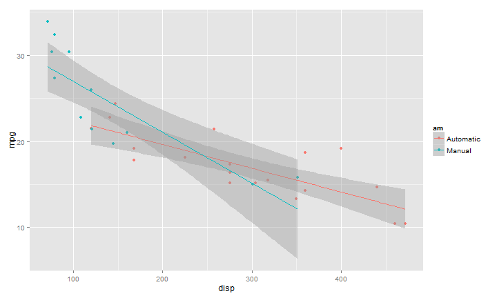

---
title       : Car mileage analysis application
subtitle    : How much mileage depends on engine and transmission type
author      : rs-coursera
job         : Coursera Student
framework   : io2012        # {io2012, html5slides, shower, dzslides, ...}
highlighter : highlight.js  # {highlight.js, prettify, highlight}
hitheme     : tomorrow      # 
widgets     : []            # {mathjax, quiz, bootstrap}
mode        : selfcontained # {standalone, draft}
knit        : slidify::knit2slides
--- .class #id 

## mtcars data

* Not so many cars in the dataset
* Not so many parameters

* Pretty much tidy dataset
* Good to learn plotting and other things

* But how does your car compares to those in the list?

--- .class #id

## So what we can do?

We can start learning about the data

```r
head(mtcars)
```

```
##                    mpg cyl disp  hp drat    wt  qsec vs am gear carb
## Mazda RX4         21.0   6  160 110 3.90 2.620 16.46  0  1    4    4
## Mazda RX4 Wag     21.0   6  160 110 3.90 2.875 17.02  0  1    4    4
## Datsun 710        22.8   4  108  93 3.85 2.320 18.61  1  1    4    1
## Hornet 4 Drive    21.4   6  258 110 3.08 3.215 19.44  1  0    3    1
## Hornet Sportabout 18.7   8  360 175 3.15 3.440 17.02  0  0    3    2
## Valiant           18.1   6  225 105 2.76 3.460 20.22  1  0    3    1
```

--- .class #id

## Setup a linear model for the purpose


```r
fit<-lm(mpg~am+cyl+disp, data=mtcars)
summary(fit)
```

```
## 
## Call:
## lm(formula = mpg ~ am + cyl + disp, data = mtcars)
## 
## Residuals:
##    Min     1Q Median     3Q    Max 
## -5.086 -1.783 -0.484  1.599  6.636 
## 
## Coefficients:
##             Estimate Std. Error t value Pr(>|t|)    
## (Intercept)  32.9169     2.7791   11.84    2e-12 ***
## am            1.9287     1.3397    1.44    0.161    
## cyl          -1.6182     0.6994   -2.31    0.028 *  
## disp         -0.0156     0.0107   -1.46    0.154    
## ---
## Signif. codes:  0 '***' 0.001 '**' 0.01 '*' 0.05 '.' 0.1 ' ' 1
## 
## Residual standard error: 3 on 28 degrees of freedom
## Multiple R-squared:  0.776,	Adjusted R-squared:  0.752 
## F-statistic: 32.4 on 3 and 28 DF,  p-value: 3.06e-09
```

--- .class #id

## Do some nice plots
 
* And see, where is your car :)
